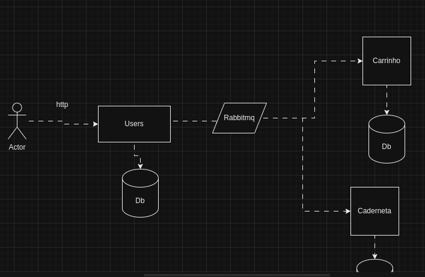

# Oi, eu sou Assis
## Sobre mim
- <!--Descrever um texto sobre mim-->

##  Linguagens

## Ferramentas

## Cursos
 *

## Projetos
<!--coloar link dos projetos caso tenha-->

<!--

 

  

  <link rel="stylesheet" href=>
-->

<!---->

## Experiência profissional

<!--Descrever caso tenha-->

## CONTATOS
 
 

    <!--INSTAGRAM-->
    
    <!-- Gmail -->

<!--Outlook-->

<!--LinkedIn-->
 
 
Fique à vontade para entrar em contato comigo e acompanhar minha jornada na área de tecnologia!
 

 ## Informações do GitHub

<!--Github Stats-->
  
  <!--Languages-->
  

